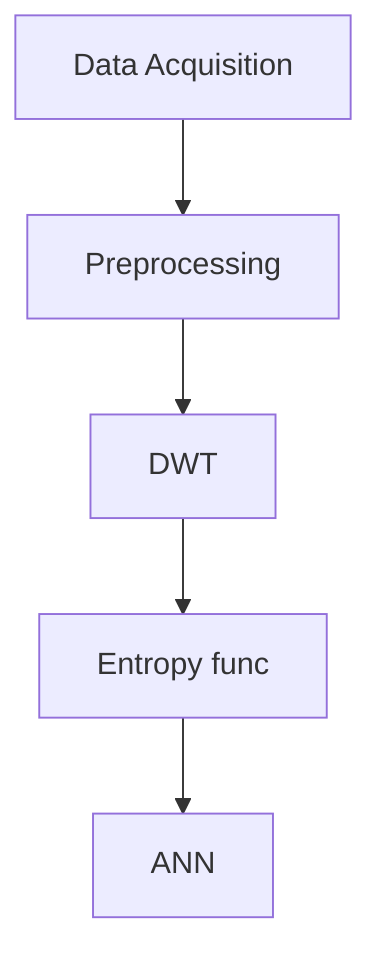

# Flow

Available channels: Fp1, F3, F7, T3, T5, O1, C4, FP2, Fz, F4, F8, C3, Cz, Pz, Oz, O2

- Preprocessing -> segmentation process, filtering, and overlapping the EEG segment
- DWT -> dismantles the EEG segment into detail coefficients (D1–D4) and the corresponding approximate coefficient (A4) for EEG subbands such as delta, theta, alpha, beta, and gamma
- Entropy values are then extracted from the original EEG segment and these coefficients to estimate the time series distribution and to reduce the dimension of the extracted features. Several statistical features (mean, standard deviation, etc.) are used also for feature extraction.

Alat:

g.tec EEG cap with high accuracy Ag/AgCl sensors (electrodes), g.tec USB amplifiers, and BCI2000 software. The data acquisition system has 16 channels, which are labeled based on 10–20 international acquisition system as shown in Figure 2. All electrodes, 16 channels, are used to record the EEG data.

Data:

- 10 healthy volunteer subjects (all of them are males, age 9–16 years) with normal intelligence and without any mental disorder.
- The second one is called autistic group and contains nine subjects (six males and three females, age 10–16 years) with autism spectrum disorders.

The dataset was filtered by band-pass filter with pass band frequency (0.1–60 Hz) and notch filter with stop band frequency (60 Hz) and all EEG signals were digitized at frequency sampling 256 Hz. The EEG recording varies from around 12 to 40 minutes for autistic subjects with a total up to 173 minutes, while, for normal subjects, recording varies from 5 to 27 minutes with a total up to 148 minutes.

Train data:

preprocessed 16 channels EEG --> DWT --> stat func/entropy --> training [inputnya adalah stat/entropy func x banyaknya level DWT] (engga selalu 96, papernya misleading, liat table 5)

## Preprocessing

Based on the above-mentioned preprocessing design exploration, we used **independent component analysis (ICA)** for eye-artifact removal and **elliptic band-pass filter** for filtering. We follow [17] that employed ICA and adaptive filtering to remove ocular-artifacts. Electrodes closed to eye (FP1, FP2, F7, and F8) are used as reference signals for ocular-artifacts removal. After ocular-artifact removal, the signals are then filtered using elliptic band-pass filter. Elliptic band-pass provides better experimental accuracy compared with other filters like Chebyshev type I and type II and Butterworth which are IIR filters [19]. Furthermore, the implementation of the elliptic filter requires less memory and calculation and provides reduced time delays compared with all other FIR and IIR filtering techniques. The proposed computer aided classification system is required to segment each EEG signal into fixed length windows. In our experimental analysis, each EEG signal was segmented into overlapping and nonoverlapping windows.

## DWT

The approximation coefficients in every level are further decomposed into next level of approximation and detail coefficients as shown in Figure 4. Selection of decomposition levels and type of mother wavelet are very important in analysis of certain signal using DWT. In this work we used 4-level DWT decomposition with Daubechies-four (db4) mother wavelet in order to extract five EEG subbands and to achieve better results in features extraction stage. The features are extracted from the detailed coefficients at various levels (D1–D4) and from the approximation coefficients at the last level (A4). Statistical features, such as mean or standard deviation and entropy value, will be calculated from these five wavelet coefficients (D1, D2, D3, D4, and A4) to construct the feature vector.

The frequency bands of EEG signal corresponding to 4-level DWT decomposition with sampling frequency of 256 Hz on the EEG signal are shown in Table 1. As shown in Table 1, the wavelet coefficients are corresponding to several EEG subbands: delta (1–4 Hz), theta (4–8 Hz), alpha (8–15 Hz), beta (15–30 Hz), and gamma (30–60 Hz). Different frequency subbands can reveal the characteristics of the time series of EEG signal. Figure 5 shows an example of approximation and details coefficients extracted from an EEG segment of autistic subject.

## Feature Extraction

In this study we investigate **five statistical features (mean, standard deviation, variance, skewness, and kurtosis)** to be extracted from each DWT output coefficient. There are many types of entropy function. We investigate several entropy functions in this study: **log energy and threshold entropies, Renyi entropy, and Shannon entropy**.

## Training and Evaluation

A well-known 10-fold cross-validation is used in all experiments. In the 10-fold cross-validation, the dataset is randomly divided into 10 equal parts (10 subsets). All the subsets are used for the training except one for the test (validation). This process is repeated 10 times (fold). Each subset is exactly used one time for testing data as shown in Figure 7. Thus, we ensure that all the examples in the features matrix are eventually used for both training and testing. The results of 10 times are averaged to produce a single classification performance.

In this current study we use the whole EEG recording for evaluation. The number of samples (or EEG segments) extracted from each subject depends on the segment length. Using one-minute (60 seconds) EEG segment length, we extracted 173 segments from autistic dataset and 148 segments from normal dataset. From these 321 segments, we select randomly 32 segments for testing and the remaining for training. As 10-fold cross-validation, this process is repeated 10 times and the results are averaged.

The performance is compared by considering receiver operating characteristic (ROC) parameters such as true positive (TP), true negative (TN), false positive (FP), and false negative (FN). True positive (TP) means that EEG segment from autistic subject ‎ is correctly diagnosed as autistic class. ROC graph shows the reliability of the classifier. The classification performance is evaluated in terms of sensitivity, specificity, and overall accuracy as in the following formulas:

## Optimization

4.3.1. Selecting the Best Segment Length

In the previous sections, the segment length is fixed to be ten seconds. In this section, we implemented our proposed approach with different window sizes (segment length). Table 4 shows the classification accuracy obtained by our proposed approach on the 10-fold cross-validation method. The best result was achieved at segment length of 50 seconds with average accuracy up to 98.6%. We obtained lower accuracy using EEG segment shorter or longer than 50 seconds.

4.3.2. Selecting Best Frequency Band (Wavelet Coefficients)

In this section, we investigated the effect of wavelet coefficients on the classification accuracy. In the previous sections, all five wavelet coefficients (D1–D4 and A4) and the original EEG segment are used for classification. In this section, we investigate the accuracy using different combination of wavelet coefficients. Table 5 shows the summary of the results. It is clear that the best result was obtained using combination of all detail coefficients (D1 + D2 + D3 + D4).

4.3.3. Testing the Effect of Nonoverlapping and Overlapping Segments

In this section, we studied the effect of overlapping segment on the classification accuracy. In (a), the all segments were nonoverlapping but in this section all the segments will be overlapped with half-segment, and window size at one minute and all detail bands (D1 + D2 + D3 + D4) were selected. By comparing Table 4 (nonoverlapping) and Table 6 (with overlapping), it is obvious that better results are obtained using overlapping EEG segment. The highest accuracy (99.8%) is obtained when the length of EEG segment is equal to 60 seconds with half-segment overlapping.
